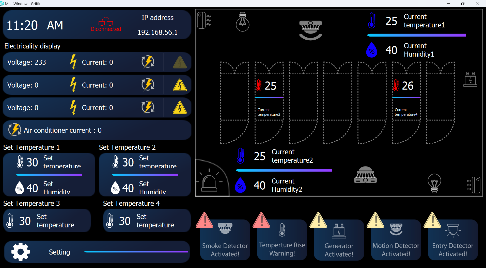
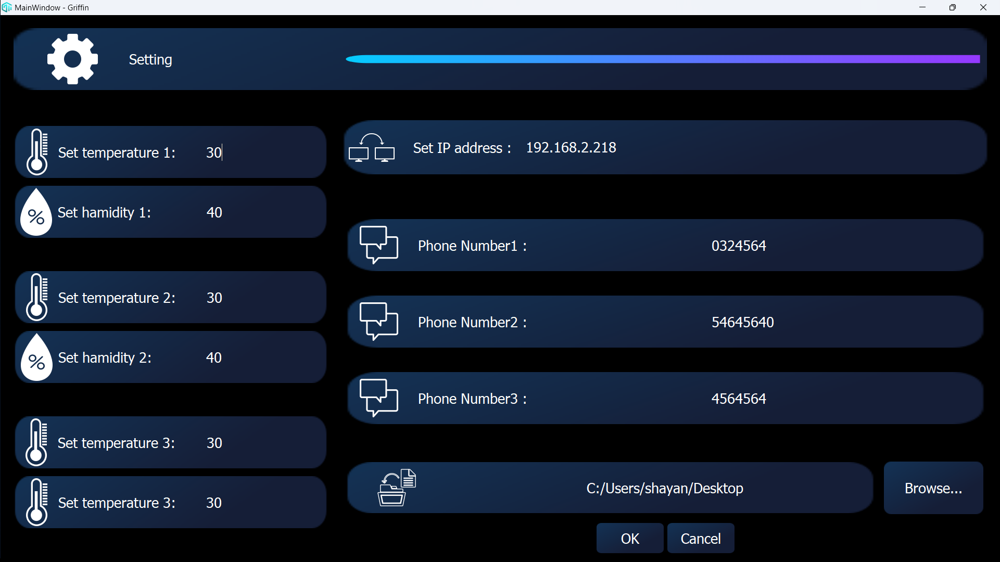

Python program for Windows based on local network and TCP protocol

The program is activated via local network and with TCP protocol and at the same time becomes a server, 
and the main sensor is connected to this server and sends the status instantly 
and the entire program is displayed live and also if it enters a dangerous state in terms of
temperature, voltage or current, it is notified by the numbers entered in the settings

www.linkedin.com/in/shayan-bayat-mokhtari-169261259

shayanbm13@gmail.com

